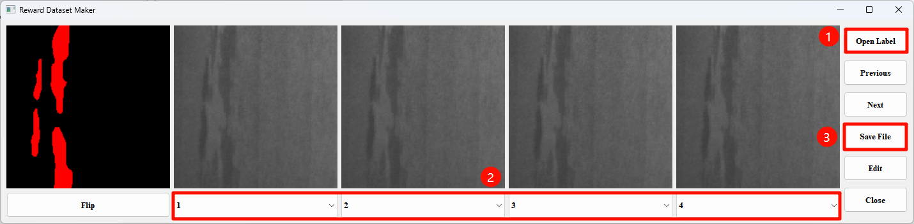

# Human-Guided Data Augmentation（under review）

## Introduction

This repository provides the related code for our research on Human-Guided Data Augmentation for Surface Defect Recognition, including Human Ranking Software, Reward Model, etc.

## Implementation

**Environment installation**

```shell
conda create -n hgda python==3.8
conda activate hgda
pip install -r requirements.txt
```

**Data preparation**

+ Download NEU-Seg dataset form [here](http://faculty.neu.edu.cn/songkechen/zh_CN/zdylm/263270/list/index.htm)
+ Download NEU-CLS dataset form [here](http://faculty.neu.edu.cn/songkechen/zh_CN/zdylm/263270/list/index.htm)
+ Download MT dataset form [here](https://github.com/abin24/Magnetic-tile-defect-datasets.)
+ The tire datasets is sourced from corporate collaborations. If you want to the data，please send  the email to us. we will send the download link once we receive and confirm your signed agreement.

**Human Ranking Software**

+ Set the working directory in the following format

    ```shell
    working directory/
    └── SourceData
        ├── GeneratedImg1
        ├── GeneratedImg2
        ├── GeneratedImg3
        ├── GeneratedImg4
        ├── SemanticLabel
        └── ClasssLabel 
    └── RankingResults
        ├── 1
        ├── 2
        ├── 3
        ├── 4
        ├── SemanticLabel   
        ├── ClasssLabel
        └── HunmanRanking.txt   # Record hunman ranking information
    ```

+ Set the working directory path in ./MakeHumanEvaluationDataset/humanRankingSoftware.py

+ run the human ranking software

  ```shell
  python ./MakeHumanEvaluationDataset/humanRankingSoftware.py
  ```


+ The ranking of software operations

  

**Reward Model**

* Set the HumanEvaluationDataset in the following format

    ```shell
    HumanEvaluationDataset/
    └── train
        ├── 1
        ├── 2
        ├── 3
        ├── 4
        ├── SemanticLabel   
        └── ClasssLabel
    └── test
        ├── 1
        ├── 2
        ├── 3
        ├── 4
        ├── SemanticLabel   
        └── ClasssLabel
    └── trainname.txt   # The name of the training image
    └── evalnname.txt   # The name of the validation image
    ```

* Training and validating the reward model

    ```shell
    python RewardModelTrain.py --train_path ./HumanEvaluationDataset/train --train_files ./HumanEvaluationDataset/train/trainname.txt --eval_path  ./HumanEvaluationDataset/test --eval_files ./HumanEvaluationDataset/train/evalnname.txt --save_dir ./chekpoints
    ```

* or just run the script

    ```shell
    sh RunRewardModel.sh
    ```


## Notes
+ If there are any issues with the code, please  send the email  to us
